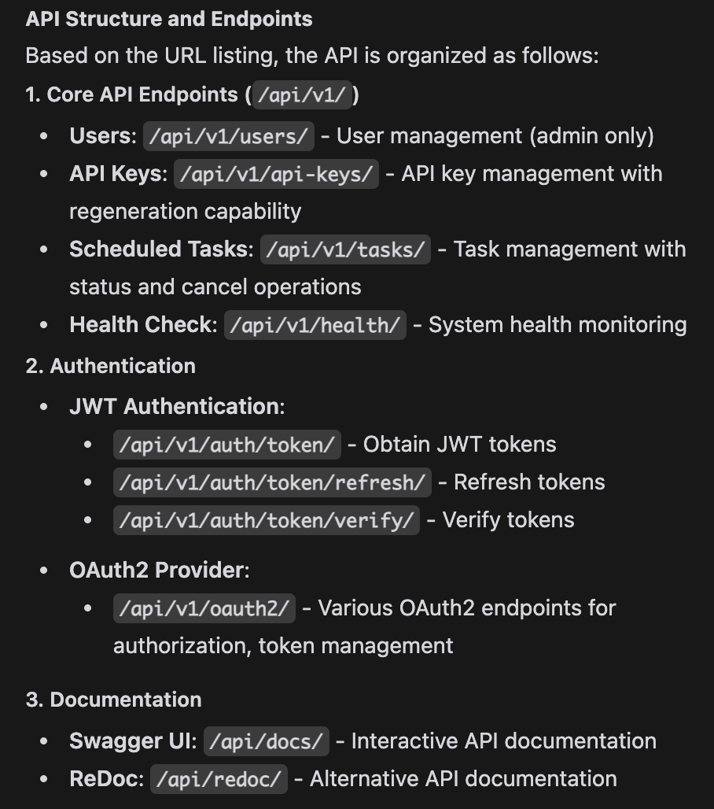

# FastAPI Endpoint Project



## Project Overview

This project is a robust Django-based RESTful API application with a well-organized structure. It follows best practices for security, performance, and architecture. The application includes JWT authentication, API key management, task scheduling with Celery, and comprehensive health monitoring.

## Technology Stack

- **Framework**: Django with Django REST Framework
- **Authentication**: JWT (JSON Web Tokens) using Simple JWT, OAuth2
- **Database**: PostgreSQL (Production) / SQLite (Development)
- **Caching**: Redis
- **Task Queue**: Celery with Redis as broker
- **Documentation**: Swagger UI / ReDoc via drf-yasg
- **Web Server**: Nginx (Production)
- **Containerization**: Docker and Docker Compose

## Project Structure

```
api/
├── backend/                  # Django project core settings
│   ├── __init__.py
│   ├── asgi.py               # ASGI configuration
│   ├── celery.py             # Celery configuration
│   ├── settings.py           # Django settings
│   ├── urls.py               # Main URL routing
│   └── wsgi.py               # WSGI configuration
├── endpoints/                # Main application containing API endpoints
│   ├── __init__.py
│   ├── admin.py              # Django admin configuration
│   ├── apps.py               # App configuration
│   ├── models.py             # Database models
│   ├── serializers.py        # API serializers
│   ├── tasks.py              # Celery tasks
│   ├── tests.py              # Unit tests
│   ├── urls.py               # App URL routing
│   └── views.py              # API views
├── media/                    # User-uploaded files
├── staticfiles/              # Static files
├── templates/                # HTML templates
├── nginx/                    # Nginx configuration
├── logs/                     # Application logs
├── .env                      # Environment variables
├── .env.example              # Example environment variables
├── .gitignore                # Git ignore file
├── docker-compose.yml        # Docker Compose configuration
├── Dockerfile                # Docker configuration
├── manage.py                 # Django management script
├── local-cert.crt            # Local SSL certificate
└── local-cert.key            # Local SSL key
```

## Core Components

### Models (`endpoints/models.py`)

1. **TimeStampedModel**: Abstract base class with `created_at` and `updated_at` fields
2. **ApiKey**: Model for managing API keys for external service authentication
   - Fields: name, key, user (FK), is_active, expires_at, last_used_at
3. **ScheduledTask**: Model for tracking Celery scheduled tasks
   - Fields: name, task_id, status, scheduled_at, started_at, completed_at, result, error_message

### Views (`endpoints/views.py`)

1. **health_check**: Endpoint to verify system component status (database, Redis)
2. **UserViewSet**: Readonly API for listing and retrieving users (admin only)
3. **ApiKeyViewSet**: CRUD API for managing API keys with a regenerate action
4. **ScheduledTaskViewSet**: API for managing scheduled tasks with cancel and status actions

### URLs Configuration

#### Main URLs (`backend/urls.py`)

```python
urlpatterns = [
    path("admin/", admin.site.urls),
    path("api/v1/", include("endpoints.urls")),
    path("api/v1/auth/", include("rest_framework.urls")),
    path("api/v1/auth/token/", TokenObtainPairView.as_view()),
    path("api/v1/auth/token/refresh/", TokenRefreshView.as_view()),
    path("api/v1/auth/token/verify/", TokenVerifyView.as_view()),
    path("api/v1/oauth2/", include("oauth2_provider.urls")),
    path("accounts/", include("allauth.urls")),
    path("api/docs/", schema_view.with_ui("swagger")),
    path("api/redoc/", schema_view.with_ui("redoc")),
    path("prometheus/", include("django_prometheus.urls")),
    path("", RedirectView.as_view(url="/api/docs/")),
]
```

#### App URLs (`endpoints/urls.py`)

```python
router = DefaultRouter()
router.register(r"users", views.UserViewSet, basename="user")
router.register(r"api-keys", views.ApiKeyViewSet, basename="apikey")
router.register(r"tasks", views.ScheduledTaskViewSet, basename="scheduledtask")

urlpatterns = [
    path("", include(router.urls)),
    path("health/", views.health_check, name="health_check"),
]
```

## API Endpoints

### Authentication

- **POST /api/v1/auth/token/**: Obtain JWT token
- **POST /api/v1/auth/token/refresh/**: Refresh JWT token
- **POST /api/v1/auth/token/verify/**: Verify JWT token
- **OAuth2**: Standard OAuth2 endpoints at /api/v1/oauth2/

### Health Check

- **GET /api/v1/health/**: System health status (database, Redis)

### Users (Admin only)

- **GET /api/v1/users/**: List all users
- **GET /api/v1/users/{id}/**: Get user details

### API Keys

- **GET /api/v1/api-keys/**: List API keys (filtered to current user)
- **POST /api/v1/api-keys/**: Create new API key
- **GET /api/v1/api-keys/{id}/**: Get API key details
- **PUT/PATCH /api/v1/api-keys/{id}/**: Update API key
- **DELETE /api/v1/api-keys/{id}/**: Delete API key
- **POST /api/v1/api-keys/{id}/regenerate/**: Regenerate API key

### Scheduled Tasks

- **GET /api/v1/tasks/**: List scheduled tasks
- **POST /api/v1/tasks/**: Create new scheduled task
- **GET /api/v1/tasks/{id}/**: Get task details
- **PUT/PATCH /api/v1/tasks/{id}/**: Update task
- **DELETE /api/v1/tasks/{id}/**: Delete task
- **POST /api/v1/tasks/{id}/cancel/**: Cancel task
- **GET /api/v1/tasks/{id}/status/**: Get task status

## Authentication Flow

1. **JWT Authentication**:
   - Client requests token with username/password at `/api/v1/auth/token/`
   - Server returns access and refresh tokens
   - Client includes access token in Authorization header for subsequent requests
   - Client can refresh token at `/api/v1/auth/token/refresh/`

2. **API Key Authentication**:
   - Users can generate API keys through the API
   - External services use these keys for authentication
   - Each use of an API key updates its `last_used_at` timestamp

## Asynchronous Task Flow

1. Client creates a ScheduledTask via `/api/v1/tasks/`
2. Celery worker picks up the task and updates status to "running"
3. Task processing occurs in background
4. Upon completion, status updates to "completed" or "failed"
5. Client can check status at any time via `/api/v1/tasks/{id}/status/`
6. Tasks can be cancelled if not yet started

## Deployment

The application is containerized using Docker and Docker Compose with the following services:

- **web**: Django application
- **db**: PostgreSQL database
- **redis**: Redis for caching and Celery
- **celery**: Celery worker for background tasks
- **celery-beat**: Celery beat for scheduled tasks
- **nginx**: Nginx for serving static files and as a reverse proxy

### Environment Variables

Required environment variables are specified in `.env.example`:

- Database configuration (PostgreSQL)
- Redis connection
- Django security settings
- Email configuration
- External service credentials

## Security Features

- JWT token authentication with short-lived access tokens
- SSL/TLS encryption (HTTPS)
- API key regeneration
- CORS protection
- Rate limiting to prevent abuse
- Password policy enforcement
- Content Security Policy
- XSS protection
- CSRF protection
- Brute-force login protection

## Monitoring

- Health check endpoint for system status
- Prometheus integration for metrics
- Sentry integration for error tracking
- Comprehensive logging

## Documentation

API documentation is available at:
- Swagger UI: `/api/docs/`
- ReDoc: `/api/redoc/`

## Local Development

1. Clone the repository
2. Create a virtual environment
3. Copy `.env.example` to `.env` and update variables
4. Run database migrations: `python manage.py migrate`
5. Start the development server: `python manage.py runserver`

For containerized development:
```bash
docker-compose up
```