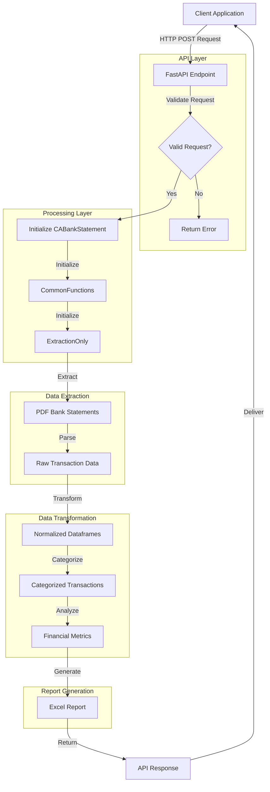
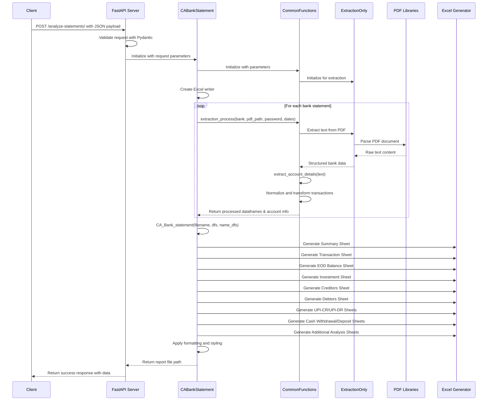

# Bank Statement Analyzer API - Technical Report

## Executive Summary

This document provides a comprehensive technical review of the Bank Statement Analyzer API, a FastAPI-based system designed to extract, analyze, and process bank statement data from PDF files. The system follows a modular architecture with clear separation of concerns between extraction, transformation, and data presentation components.

## Project Structure

The project is organized as follows:

```
.
├── main.py                       # FastAPI application entry point
├── code_for_extraction.py        # Core PDF extraction logic
├── common_functions.py           # Utility functions for data processing
├── tax_professional/             # Module for bank-specific functionality
│   └── banks/
│       ├── __init__.py
│       └── CA_Statement_Analyzer.py # Bank statement analysis implementation
├── test_endpoint.py              # Example API client for testing
├── gather_info.py                # Helper for gathering information
├── old_bank_extractions.py       # Legacy extraction code
└── saved_excel/                  # Directory for storing generated Excel files
```

## System Architecture

### Core Components

1. **API Layer** (`main.py`)
   - FastAPI application providing HTTP endpoints
   - Request/response handling and validation
   - Error handling and logging

2. **PDF Extraction Engine** (`code_for_extraction.py`)
   - `ExtractionOnly` class for parsing PDF bank statements
   - Bank-specific extraction rules and patterns

3. **Data Processing** (`common_functions.py`)
   - `CommonFunctions` class with extensive utility methods
   - Transaction categorization algorithms
   - Data transformation and analysis functions

4. **Statement Analysis** (`tax_professional/banks/CA_Statement_Analyzer.py`)
   - `CABankStatement` class implementing bank statement processing
   - Excel report generation with multiple sheets
   - Progress tracking functionality

## Data Flow

### Complete API Flow

1. **Request Initiation**
   - Client submits a POST request to `/analyze-statements/` endpoint
   - Request includes bank names, PDF paths, passwords, date ranges, and CA ID

2. **Request Validation**
   - FastAPI validates the request structure using Pydantic models
   - Password validation against PDF count

3. **Initialization**
   - `CABankStatement` class is instantiated with request parameters
   - Progress tracking function is set up for real-time feedback

4. **PDF Extraction**
   - `ExtractionOnly` class is initialized via `CommonFunctions`
   - PDFs are processed based on bank-specific extraction methods
   - Text is extracted and parsed to identify transactions

5. **Data Transformation**
   - Extracted transaction data is converted to standardized dataframes
   - Account details are identified and normalized
   - Date filtering is applied based on request parameters

6. **Transaction Analysis**
   - Transactions are categorized using advanced pattern matching
   - Financial metrics are calculated (opening/closing balances, averages)
   - Various transaction types are identified (UPI, NEFT, RTGS, etc.)

7. **Report Generation**
   - Excel workbook is created with multiple specialized sheets:
     - Summary sheet with key financial indicators
     - Transaction sheet with all normalized transactions
     - EOD Balance sheet showing daily balances
     - Multiple analysis sheets (Investments, Creditors, Debtors, etc.)
   - Sheets are formatted with appropriate styling and notes

8. **Response Delivery**
   - Generated Excel file path is included in the response
   - Success message and status are returned to the client

## Technical Implementation Details

### Request Model

```python
class BankStatementRequest(BaseModel):
    bank_names: List[str]         # Names of banks for the statements
    pdf_paths: List[str]          # Paths to PDF statement files
    passwords: Optional[List[str]] = []  # Optional passwords for encrypted PDFs
    start_date: List[str]         # Start dates for analysis period
    end_date: List[str]           # End dates for analysis period
    ca_id: str                    # Identifier for the CA
```

### Processing Logic

The core processing happens in the `start_extraction` method of `CABankStatement` class:

1. Creates an Excel writer for output
2. Processes each bank statement PDF in sequence:
   - Extracts text from PDFs using bank-specific methods
   - Identifies account details and transaction data
   - Normalizes transaction data into standardized format
3. Generates comprehensive Excel report with multiple analysis sheets
4. Applies formatting, filters, and notes to the report
5. Returns the file path of the generated report

### Data Categorization

The system employs sophisticated pattern matching and regex-based rules to categorize transactions:

1. **Entity Extraction**: Identifies transaction counterparties from descriptions
2. **Transaction Classification**: Categorizes as credits, debits, cash deposits, withdrawals, etc.
3. **Purpose Identification**: Detects transaction purposes (EMI, investment, salary, etc.)

### Error Handling

The system implements comprehensive error handling:
- PDF parsing errors (invalid format, encryption)
- Data validation errors (date range, account matching)
- Processing errors with detailed logging

## API Usage

Example client request:

```python
import requests

url = "http://localhost:7500/analyze-statements/"
payload = {
    "bank_names": ["AXIS"],
    "pdf_paths": ["/path/to/statement.pdf"],
    "passwords": ["password123"],
    "start_date": ["01-04-2023"],
    "end_date": ["30-04-2023"],
    "ca_id": "CA12345"
}

response = requests.post(url, json=payload)
```

## System Diagram



## Detailed Component Flow



## Technical Challenges and Solutions

1. **PDF Text Extraction**
   - Challenge: Different banks use varied PDF formats and structures
   - Solution: Bank-specific extraction patterns and rules in `ExtractionOnly` class

2. **Transaction Categorization**
   - Challenge: Inconsistent transaction descriptions across banks
   - Solution: Sophisticated regex pattern matching with bank-specific rules

3. **Performance Optimization**
   - Challenge: Processing large PDF statements efficiently
   - Solution: Streamlined extraction workflow with progress tracking

## Recommendations for Future Development

1. **Architecture Improvements**
   - Implement a more robust database storage solution for extracted data
   - Consider containerization (Docker) for easier deployment and scaling
   - Implement caching for frequently accessed data

2. **Feature Enhancements**
   - Develop a machine learning model for improved transaction categorization
   - Add support for additional banks and statement formats
   - Implement user authentication and multi-tenancy

3. **Code Quality**
   - Refactor larger classes and functions into smaller, more maintainable units
   - Enhance test coverage with unit and integration tests
   - Standardize error handling throughout the codebase

## Conclusion

The Bank Statement Analyzer API provides a powerful solution for processing bank statements, extracting transaction data, and generating comprehensive financial analysis reports. The system's modular architecture allows for continued expansion and enhancement to support additional banks and reporting requirements.

The current implementation successfully demonstrates the core functionality of bank statement analysis but would benefit from the architectural and code quality improvements outlined above to enhance maintainability, scalability, and performance. 